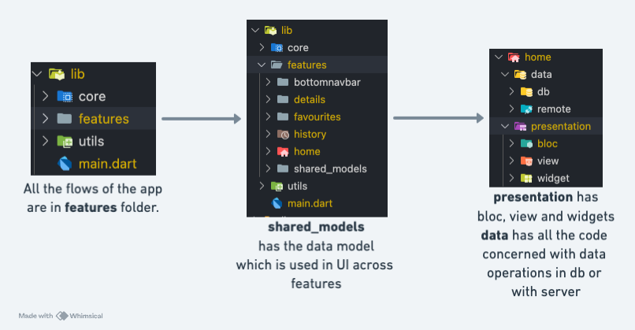

# Pawfect-match

Pawfect-match is a cross-platform Flutter application that lets users browse through pets up for adoption.


## Download APK file from Google Drive 📥

[](https://drive.google.com/drive/folders/19XLv52RbdjUHH50n_YXRRN8gjwi3Q72l?usp=sharing)

---

## Features

- Browse through pets up for adoption.
- Search and filter pets by name.
- Zoom in or out the pets' pictures.
- Light/dark theme toggle for better UX.
- Add any pet to favourites.
- Animations for attractive UI.

## Setup Instructions

### Prerequisites

- Flutter 3.29.3
- Dart 3.7.2

### Packages used
```bash
dependencies:
  flutter:
    sdk: flutter
  hive: ^2.2.3
  hive_flutter: ^1.1.0
  bloc:
  flutter_bloc:
  flutter_dotenv: ^5.2.1
  http:
  flutter_screenutil: ^5.9.3
  provider:
  shared_preferences: ^2.5.3
  bloc_concurrency: ^0.3.0
  dotted_border: ^2.0.0
  cached_network_image: ^3.4.1
  font_awesome_flutter: ^10.7.0
  auto_size_text: ^3.0.0
  pull_to_refresh: ^2.0.0
  confetti: ^0.8.0
  bloc_test: ^10.0.0
```

### Clone the Repository
```bash
git clone https://github.com/anujjainwork/adopt-pet.git
cd adopt-pet
```

### Install Dependencies
```bash
flutter pub get
```

### Run the Application
```bash
flutter run
```


## Project structure
While a clean architecture could have been implemented, I chose to keep the structure simpler for now to avoid unnecessary complexity.




---

### Contributions
All credits go to @anujjainwork (Github profile)
---
